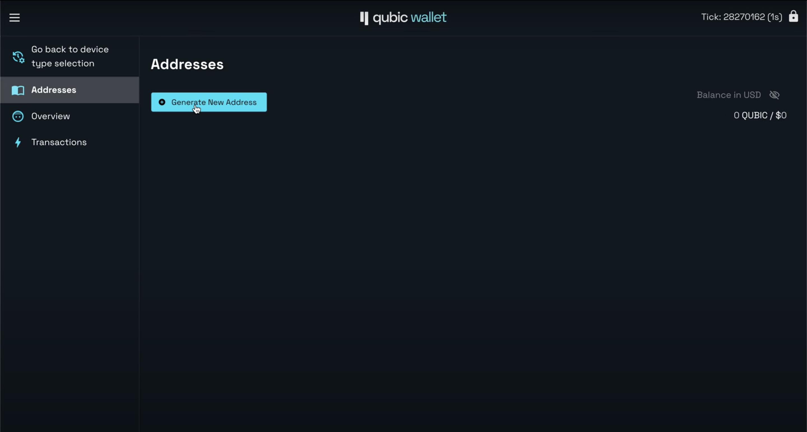
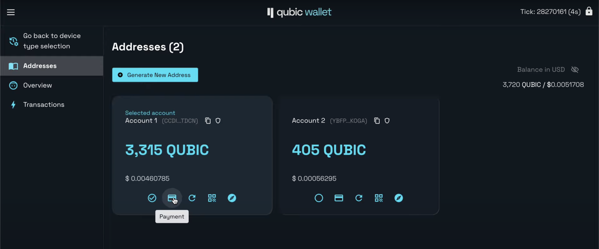
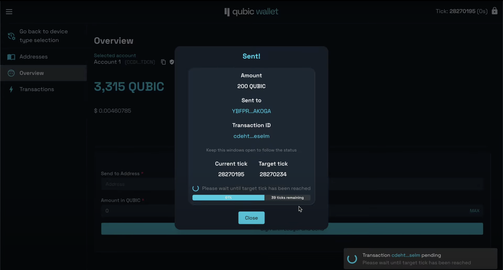
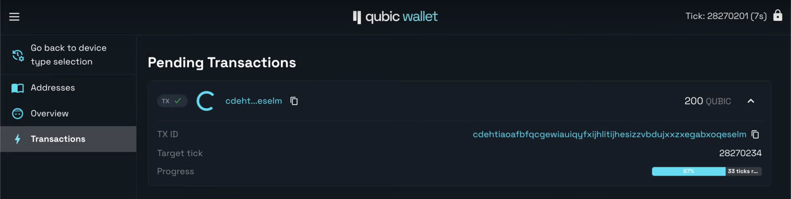

# Qubic Ledger Wallet Guide
## Introduction
https://hw.qubic.org is a simple web interface for interacting with the Ledger Qubic app. You can use it to receive and send QUBIC with your Ledger device.
## Qubic App Installation
To install Qubic in your Ledger device follow the instructions [here](https://support.ledger.com/article/4404382258961-zd) search for the Qubic app and install it.
## Usage
### How to Connect

- Connect your Ledger device to your desktop computer using USB.
- Launch the Qubic app on your Ledger device.
- On your desktop, open [https://hw.qubic.org](https://hw.qubic.org) in Chrome or Edge (WebHID is not supported in other browsers).
- Select “Connect with USB.”
- Choose the device you wish to use. 
### Viewing your Addresses and Balances

After connecting your device, the Addresses tab will be empty at first: Click on "Generate New Address" to create a new address or reveal addresses which you have already created with your Ledger device.

### Sending Funds

- Enter the recipient's address in the “Send to Address” field. 
- Input the desired sending amount in the “Amount in QUBIC” field.
- Click on the “Sign with Ledger and Send” to initiate the review process. You can then verify the transaction in your Ledger device. You can Approve or Reject the transaction.
- Approving the transaction signs and sends it to the network.
- A confirmation will display transaction information as well as status.

- If you close the modal, the same information can be seen in the "Transactions" tab

### Support
In case of any questions, post them in the `#lfg` channel in the [Qubic Discord](http://discord.gg/qubic). # ledger-wallet-howto